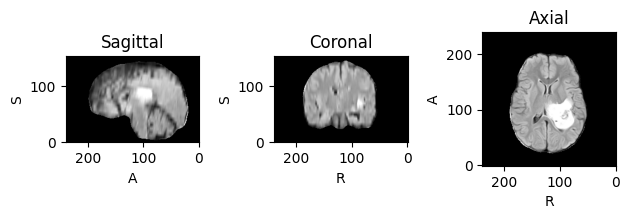

---

# Introduction to TorchIO

This repository contains a tutorial on using **TorchIO** for medical image processing.
- Loading and visualizing MRI scans
- Applying various transformations

### Dataset

We use **single-channel T2-FLAIR NIfTI** samples from the **ASNR-RSNA-MICCAI Africa Dataset of Brain MRI with tumors**.

### Running the Tutorial

You can follow along with the tutorial by running the provided Notebook 

### References

[1] TorchIO 

[2] The Brain Tumor Segmentation (BraTS) Challenge 2023: Glioma Segmentation in Sub-Saharan Africa Patient Population (BraTS-Africa)

---
